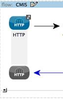
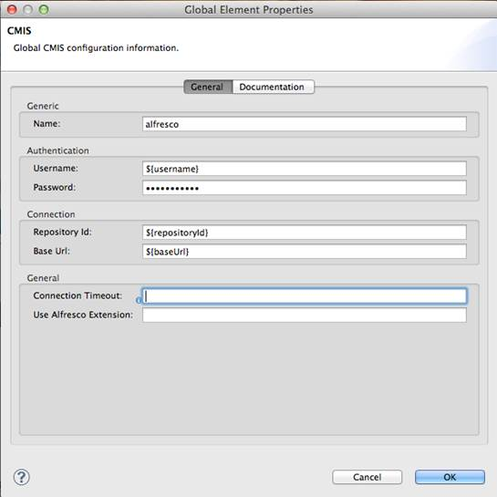
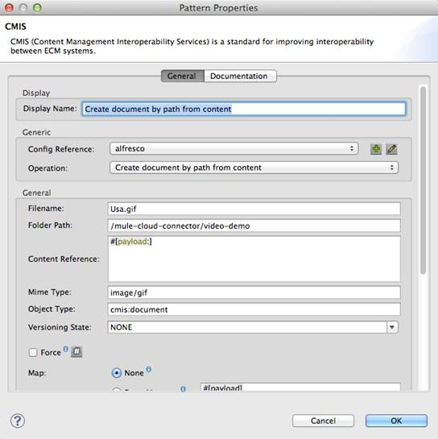

**CMIS**  

Contents:
1.  Prerequisites  
2.  Project Overview  
3.  Step 1: Create a New Mule Studio Project  
4.  Step 2: Configure the HTTP Endpoint  
5.  Step 3: Configure the CMIS Cloud Connector  
6.  Step 4: Add Groovy Component  
7.  Step 5: Use the operations  
8.  Step 6: Add Object to Json transformer  
9.  Step 7: Run the Project  
10. Next Steps  

**Prerequisites** 

This tutorial assumes that you have the following software downloaded, installed and configured. Please take a moment to review them if you haven't already done so.

Installing and Running CMIS Workbench

- cmis.alfresco.com/opencmis/workbench.jnlp

Installing and Running MuleStudio

- [www.mulesoft.org/documentation/display/MULE3STUDIO/Installing+Mule+Studio](http://www.mulesoft.org/documentation/display/MULE3STUDIO/Installing+Mule+Studio)

Installing CMIS Connector

- [www.mulesoft.org/documentation/display/MULE3STUDIO/Additional+Cloud+Connectors](http://www.mulesoft.org/documentation/display/MULE3STUDIO/Additional+Cloud+Connectors)

**Project Overview**

This tutorial introduces the CMIS cloud connector, and describes additional concepts.

Completing this tutorial should take about 15 minutes. You will accomplish the following:

- Learn about cloud connectors, and build a project that accesses a CMIS repository using Mule Studio
- Learn about the Groovy component, HTTP Endpoint and the Object to Json transformer

With cloud connectors, you can leverage many Software-as-a-Service (SaaS) platforms and quickly build cloud-to-cloud integrations, cloud-to-on-site applications, and much more. This tutorial introduces you to the CMIS cloud connector, and shows you how to configure it to access your repository. The tutorial also discusses payloads and shows you how to use expressions, using the Mule Expression Language, to modify and view messages at various points in the project flow.

Key Concepts Covered in this Tutorial:

<table>
<tr>
<th>Component</th>
<th>Description</th>
</tr>
<tr>
<td> CMIS </td>
<td>To demonstrate how cloud connectors simplify API integration, this project uses the CMIS cloud connector to access a repository and upload a file.</td>
</tr>
<tr>
<td> HTTP </td>
<td>HTTP Endpoint to send and receive requests over HTTP transport protocol.</td>
</tr>
<tr>
<td> Object to Json </td>
<td>The Object to JSON Transformer converts a Java object to a JSON encoded object that can be consumed by other languages, such as JavaScript or Ruby.
</td>
</tr>
<tr>
<td> Groovy </td>
<td>The Groovy Component defines a script component backed by a Groovy script engine.
</td>
</tr>
</table>

**Step 1: Create a New Mule Studio Project**

   To begin building this application, start Mule Studio and create a new project:

1. Select **File -\> New -\> Mule Project**

2. In the New Mule Project configuration menu, provide a name for this project: *cmis\_demo*

3. Click **Next** and provide a name for the flow: *cmis-demo*

4. Click **Finish**.

A new project opens with a blank canvas for building the flow, and the Palette with Message Processors to the right.

**Step 2: Configure the HTTP Endpoint**

The first component (also called a message processor) in the flow is a HTTP Endpoint. This Endpoint will launch a web page at the URL you choose when deploying the project.

1. Locate the **HTTP** component in the **Endpoints** category of the Palette. Drag and place it on the canvas. Since you are placing the first component on the canvas, Mule Studio will create a containing-box around it, and label it "**cmis-demo**". As you add additional components to the flow, you will want to place them inside this same containing box. 

2. Open the HTTP Endpoint configuration menu. To do so, double-click on the component you just placed on the canvas, or choose "Properties" from its context menu.
3. Leave the default Port (**8081**) and Host (**localhost**).
4.  Enter **cmis** in the Path field.
5.  Click **OK** to close the configuration menu.

**Step 3: Configure the CMIS Cloud Connector**

1. Locate the **CMIS** message processor in the **Cloud Connectors** category of the Palette. Drag and place it on the canvas to the right of the HTTP Endpoint.

2. Double-click on the CMIS cloud connector in your flow to open its properties menu.
3. Note an error stating that "config-ref" is required, and an "x" next to the Config Reference form field. Click on the "+" icon next to this form field to create a "CMIS Global Element".
4. A **Global Element** properties menu opens. Fill username, password, and Base Url. For this example you can use the Alfresco repository located at Base Url: http://cmis.alfresco.com/cmisatom for which the username and password are both: "admin".  
Note:  
A *Global Element*allows to enter configuration information, such as your API credentials, once. You can then reference the Global Element many times within your flow (although for this project we only need to reference it once). Note the Global Elements tab under the Mule Studio canvas; this tab provides an alternative view for managing all Global Elements defined for this project.

5. The CMIS Properties menu should still be open. Notice that the Config Reference field has been updated to point to the new "CMIS" Global Element.
6. Select **Get or Create folder by path** from the Operation drop-down field.
7. Enter */mule-cloud-connector/demo-video* in the Folder Path.
8. Click **OK** to close the CMIS Properties menu.

The CMIS cloud connector configuration is complete. The red "x" next to its icon in the flow should no longer be present.             

               

**Step 4: Add Groovy Component**

1. Locate the **Groovy** component in the **Components** category of the Palette. Drag and place it on the canvas to the right of the expression component.  
2. Double-click on the **Groovy** component to open its properties menu.  
3. Change the Display Name to **Load file.**  
4. Enter this in the Script Text field:

        import java.io.FileInputStream;
    
        return new FileInputStream("/Users/andrew/Desktop/CMIS/resources/USA.gif");
Note: This file path with need to be changed to point correctly point to a GIF on your local system.

5. Click **OK** to close the Groovy component Properties menu.  

**Step 5: Use the operations**

Insert another CMIS connector after the Groovy script component and configure it to Create document by path from content: the configuration should look like this except that **Versioning State** should be set to *MAJOR* rather than *NONE* and the **Filename** field will need to be set to the name of whatever file you are using:

When finished, the flow should look like this:

  

        

**Step 6: Add the Object to JSON Transformer**

In this project, we will add an Object to JSON Transformer to the flow. In doing so, we will be able to view the response payload produced by CMIS in the browser.

1. Locate **Object to JSON** in the **Transformer** category of the Palette.  
2. Drag and place it on the canvas to the right of the last operation.

 

**Step 7: Run the project**

You are now ready to run the project! First, you need to run the flow form Studio, then open your favorite browser and type [http://localhost:8081/cmis](http://localhost:8081/cmis) and finally see the results.

**Next Steps**

For further information about this cloud connector, see these references:

- mulesoft.github.com/cmis-connector/mule/cmis-config.html
- cmis.alfresco.com
